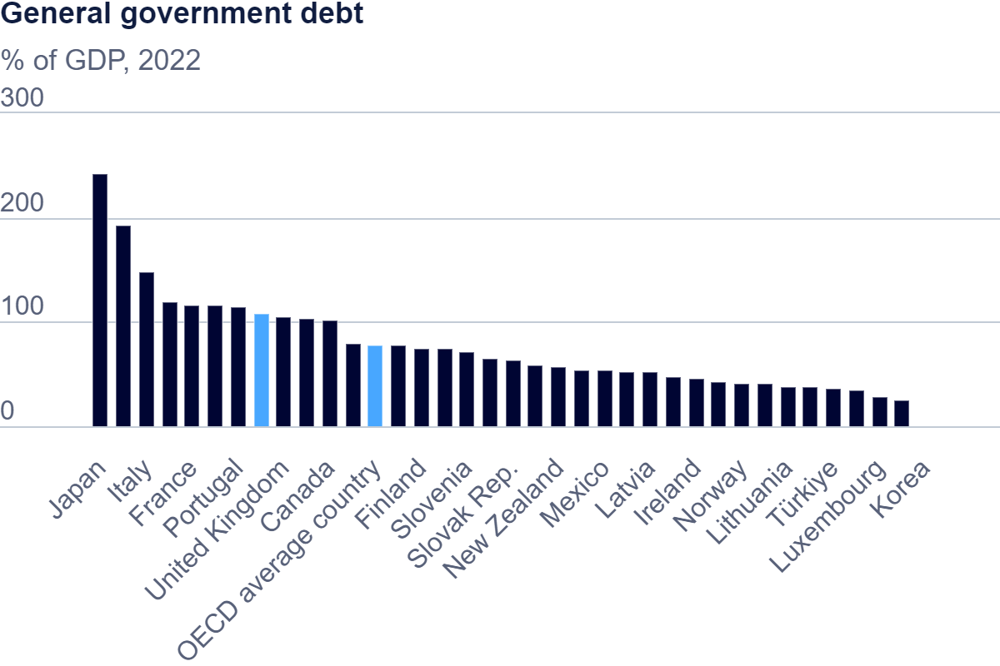

  <noscript>
    
  </noscript>
  <object class='tableauViz' width='100%' height='850'>
    <param name='host_url' value='https%3A%2F%2Fpublic.tableau.com%2F' /> 
    <param name='embed_code_version' value='3' /> 
    <param name='name' value='OECDData_17259212923200/Debt-to-GDPRatiosbyCountry' />
    <param name='tabs' value='no' />
    <param name='toolbar' value='yes' />
    <param name='static_image' value='https://public.tableau.com/static/images/OE/OECDData_17259212923200/Debt-to-GDPRatiosbyCountry/1.png' />
    <param name='animate_transition' value='yes' />
    <param name='display_static_image' value='yes' />
    <param name='display_spinner' value='yes' />
    <param name='display_overlay' value='yes' />
    <param name='display_count' value='yes' />
    <param name='language' value='en-US' />
    <param name='filter' value='publish=yes' />
  </object>

[return to main page](README.md)
