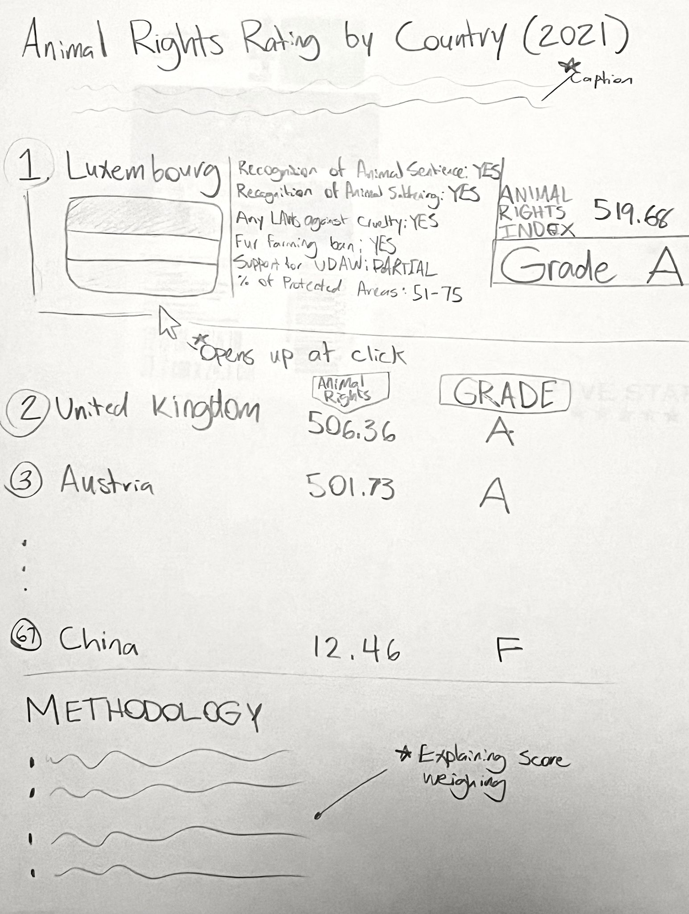
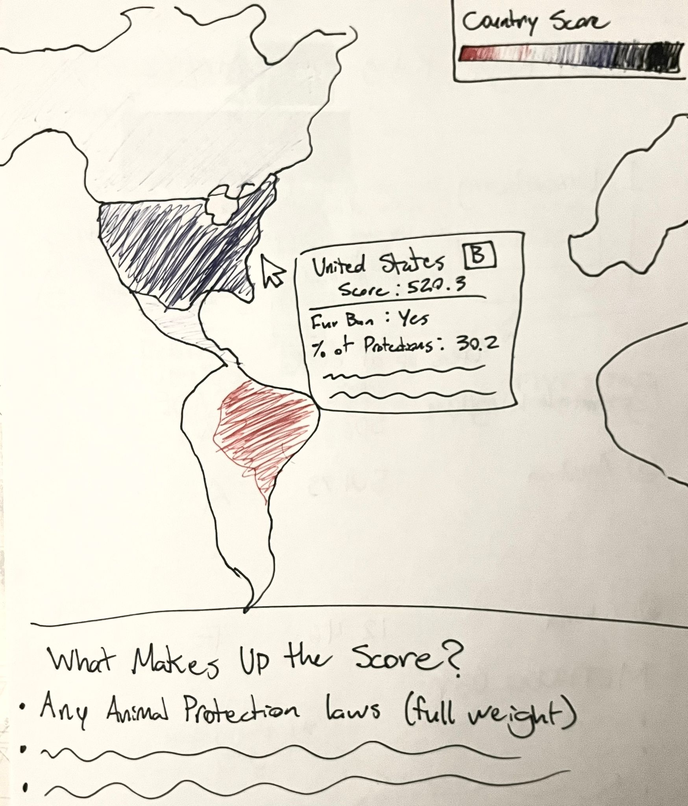

## Creating A Makeover Monday Visualization
The original data visualization I looked at was a list that looked at countries ranked by their animal rights laws and regulations (https://theswiftest.com/animal-rights-index/#:~:text=Animal%20rights%20laws%20vary%20greatly,cruelty%20any%20way%20they%20can). The visualization served a clear purpose to show the extent to which countries had existing metrics that showed regard for animal life, laws that existed for animal rights, and their sentiment toward animal sentience and global efforts to acknowledge and work toward maintaining basic animal rights. The visual seemed like a perfect opportunity to try to either fix it’s approach or change the entire structure altogether.
In the visual, I noticed a lot of pressing issues with the way it was outlined. First, it relied too much on visual markers that were hard to read, and colors that weren’t utilized in a way that make sense. The most noticeable aspect was the categories that had “yes” or “no” or “partial” values used a visual with unclear pictures and colors that were either yellow or green. What separated a yes from a partial was that the marker was only half-shaded versus fully shaded, however the image of an animal overlaid made it hard to distinguish. The colors were also not well utilized. I could have been able to easily tell if something was good or bad if it was color coded in, say, red for ‘no’ and green for ‘yes.’ Better yet, it could have been solved with just saying “yes” or “no” rather than trying to symbolize it and include a legend. 
The list was also long, so the labels for all the criteria listed were lost in the middle of the list, just giving the reader a list of colored dots and scores. This doesn’t impede on the audience’s ability to see the grade or score, but it does hurt their ability to see the breakdown of why the score is what it is. 

## Drafting Revisions
I decided to see if I could fix the approach with the list. My first thought was to just fix the issues seen on the list and make a revised one that’s easier to read:

This updated list I sketched out was meant to streamline the issues I noticed earlier. Primarily, I wanted to fix the issue of not being able to read the data while scrolling down. I noted that the total score and grade were the only features that can instantly be understood and thought of, making a tooltip that can open up when clicking over the country that shows the entire breakdown of the score. The breakdown as well, did not include any color coding or visuals, but remained simple and showed only the actual values for yes and no categories. 
During my initial interviews I asked if the visual made sense to unpack. I got a few comments saying that the list made much more sense than the original, however there was still a problem with needing to scroll down to see how the scores were broken down and weighed. This made for a question on whether or not I should put the breakdown above the list or find a new workaround. 
During the second critique, I showed the same visual I came up with, and was given similar comments from my peers. However, they did have some additional points to make. One of which was that, if I was trying to maintain the ranking among the list and it was causing a lot of issues, was the list actually worth including? I thought about the ranking of the countries, and the grading system between them. I realized that the countries that performed very well were at such close margins while those that were performing very poorly were far worse. I figured doing a list didn’t help as much as noticing the high performers and those that showed concerningly low scores. That was when I was suggested to try using a map instead. 
I attempted a concept sketch for a map and noticed a lot of improvement. To get the low performers to clearly stand out in the map, I decided to do a red and blue diverging color scheme and keep some of the similar elements to break down the score via the tooltip. Another solution that came from this is that the score breakdown caption could theoretically be visible without needing to scroll down to see it. That way the audience can freely look around the map and easily be able to make sense of the scores and values they are seeing.

<noscript></noscript><object class='tableauViz'  style='display:none;'><param name='host_url' value='https%3A%2F%2Fpublic.tableau.com%2F' /> <param name='embed_code_version' value='3' /> <param name='path' value='shared&#47;F579W53P8' /> <param name='toolbar' value='yes' /><param name='static_image' value='https:&#47;&#47;public.tableau.com&#47;static&#47;images&#47;F5&#47;F579W53P8&#47;1.png' /> <param name='animate_transition' value='yes' /><param name='display_static_image' value='yes' /><param name='display_spinner' value='yes' /><param name='display_overlay' value='yes' /><param name='display_count' value='yes' /><param name='language' value='en-US' /><param name='filter' value='publish=yes' /></object>

