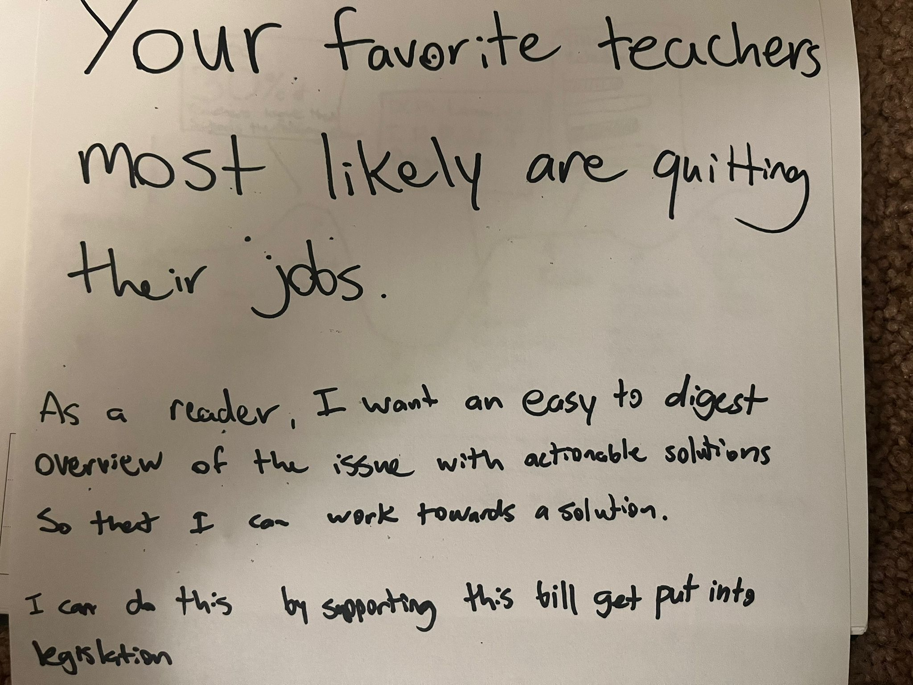
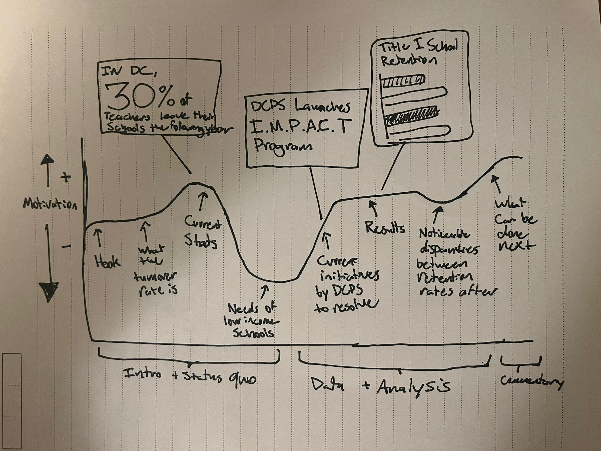

## Outline 

When deciding on a topic for the presentation, my first curiosity was with DC Public Schools (DCPS), namely because it was an area that I cared about as a former teacher in DCPS. I also felt like there were insights that could be drawn from the data that the Office of the Superintendent puts out that aren’t being highlighted. Teacher turnover, especially in disadvantaged communities, is a really relevant issue in DCPS and has asubstantial impact on student performance and school stability. I looked into the issue in the past but with a much more surface lens. At the time, DC schools were struggling to maintain a good retension rate and created a program called IMPACT as a result. The IMPACT program was a merit based program for educators who score high in their rubrics to receive an additional bonus. The project, howver, didn't take into account the turnover rate in disadvantaged schools where it's unlikely that an educator there can score high enough to get the bonus compensation. So what I would like to do in this project is explore how turnover rates vary across different locations/wards in DC as well as assess the effectiveness of DCPS’s teacher evaluation and retention policies, particularly the IMPACT program (2019 onwards). 

When coming up with a compelling opener, I thought to myself what would get an audience member's attention so I decided to go with a strong opener that gets the readers attention but with enough layers underneath to build and explore further. 

Based on this, the general outline for my presentation is as follows:

> Introduction: Analyzing teacher turnover in DC Public Schools (DCPS), particularly focusing on disparities between low-income (Title I) and high-income schools, and the effectiveness of current policies like IMPACT.
Why It Matters: Highlight the importance of addressing teacher turnover, especially in schools serving disadvantaged communities, and its impact on school stability and student outcomes.
What the Turnover Rate Is:

> Defining Turnover: Provide a clear explanation of what teacher turnover means, how it’s measured, and why it’s a critical issue for DCPS.
General Turnover Data: Present overall turnover rates in DCPS, giving an overview of how frequently teachers are leaving the system, and which schools or wards experience the highest turnover.
DCPS’ Current Stats:

> Current Data on Turnover: Visualize current teacher turnover rates across DCPS, highlighting patterns and trends. Break down data by ward, income levels, and school type.
Demographic Disparities: Showcase how teacher turnover differs between schools in different socioeconomic areas, using visualizations to emphasize disparities.
Needs in Title I Schools:

> What Title I Schools Are: Provide context on Title I schools, their unique challenges, and why they often face higher teacher turnover rates.
Teacher Retention Challenges: Explain why teachers in Title I schools are more likely to leave, focusing on factors like high stress, lack of resources, and student needs.
Current Initiatives (IMPACT):

> Overview of IMPACT: Explain the IMPACT program as DCPS’s main initiative to improve teacher performance and retention, including its merit-based rewards system.
Limitations of IMPACT: Analyze how the program might fail to account for the unique challenges in disadvantaged schools, where teachers may struggle to meet high-performance benchmarks required for bonuses.

>Turnover Post-IMPACT: Present data showing turnover rates before and after the implementation of the IMPACT program. Evaluate whether the program has had any significant effect on retaining teachers, particularly in Title I schools.
Disparities Between Low-Income and High-Income Schools:

>Visualizing Disparities: Use data to highlight the noticeable disparities between teacher retention in low-income vs. high-income schools. Discuss how the IMPACT program may disproportionately benefit schools in wealthier areas.

>Conclusion: Actionable recommendations for improving teacher retention in Title I schools, including potential reforms to the IMPACT program or introducing new support systems for teachers in disadvantaged areas.

## Data & Sketches 

For this project, I will be primarily using datasets available from the Office of the State Superintendent of Education (OSSE). These datasets provide crucial information on teacher turnover rates, school performance metrics, and demographic details of schools across Washington, D.C. This data will allow me to analyze the disparities in teacher retention between Title I (low-income) and non-Title I schools. I will use this to explore the correlation between teacher turnover and school demographics, as well as the performance outcomes of schools most affected by turnover.

A few sketches that I thought would make sense with the kind of data being used is a choropleth map of the District by Ward. Since DC has 8 wards, they can indicate geographically noticeable areas that have higher/lower retention rates. This can also transcend the Title I distinction too if, say, schools all over ward 8 show similar patterns or current turnover rates. Either way, I think the distinction would be helpful to include, so much so, that I included a tooltip that breaks down the overall turnover with a breakdown of title I and non-title I schools involved. 

I also think in general the bar plots would help with distinguishing the wards for their retension rate, so something more value driven could be tied to a barplot.

## Method and Medium:

To complete this project, I will be using Tableau to create interactive data visualizations that showcase teacher turnover rates, demographic disparities, and/or the impact of DCPS's IMPACT program. My aim will be to make the information easy to digest for viewers and explore different facets of the data, such as geographic trends and correlations between turnover and school performance. The narrative aspect of the project will be built using Shorthand, an interactive storytelling platform that will help me seamlessly integrate the data visualizations with text and other media. My goal is to have an audience filled with expertise on the current status and nuances behind the turnover rate in DC.

[return to main page](README.md)
