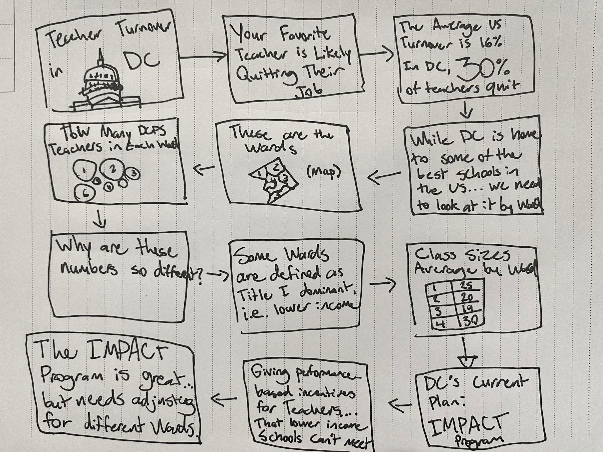

# Wireframes / storyboards
> Using your sketches developed last week, further develop your story outline and relevant components visually through the use of wireframing / storyboards. Using your outline as a guide, include high-fidelity, individual draft data visualizations of the critical elements of your story you want to share with your reader. Note: you can build these elements out directly in Shorthand this week if you wish.  Reminder: this template is intended to help, but it doesn't substitute for reading through the full homework assignment!  The assignment page on Canvas includes many important details for completing Part II of the final project. 

When developing the storyboard for my topic, I knew that I wanted to touch on four major points: The current turnover rate in DC, breaking down DC into their respective Wards, introducing DC's current solution to the problem via the IMPACT Program, and looking at the differences in turnover rates by ward as well as other adverse factors such as average class sizes. One of the trickiest things I had to grapple with is where I should stop showing the numbers and data for DCPS and start putting in the context of how DCPS is tackling the issue. I believed at first that I should introduce it in the middle of the storyboard to put it into context later with my visualizations how it's approach for providing bonuses to high performing educators can unfairly assess educator's that have far more disadvantages in earning the scores necessary to gain a bonus through the program. However, I thought it would work better to have the audience see the program towards the end, after already understanding the extent of disparities that exist between some schools that aren't well off compared to others. That way, when I introduce the IMPACT program in my story, the audience almost already can put together that this program is fundamentally not accounting for the schools that they've just seen need help. So with that, I developed my storyboard:

# User research 

## Target audience
> Include your approach to identifying representative individuals, and who you hope to reach with your story. 

The target audience for this data visualization project is primarily DC policymakers or policy students, educational administrators, and concerned community members. These individuals are deeply invested in understanding and addressing teacher turnover rates within DC Public Schools (DCPS). By breaking down the data by ward and presenting factors like turnover rates, average class sizes, and the effectiveness of programs like IMPACT, the goal is to reach individuals who have decision-making power in these areas.

My approach to identifying interview participants was to target individuals who closely match this audience. I aimed to speak with a public policy student (classmate), a DC educator (an old coworker of mine), and a DC resident (a colleague from the DC metro area). 

## Interview script
> List the goals from your research, and the questions you intend to ask. 

I intended to see how my appraoch varies in terms of comprehnsion for all three individuals since they vary in terms of how directly related they are to the issue; the educator being the direct topic of discussion, the DC resident being a relevant community member but not fully immersed in the education space, and a policy student who can engage with the topic broadly but aren't aware of the current context of DC's issue. 

| Goal | Questions to Ask |
|------|------------------|
| Make the topic easy to understand     | What were your main takeaways from the story? Did you feel like something was missing in my breakdown? What would you have liked to see?                 |
| Ensure the value and purpose of my visualizations are shown     | What did you think of the map/chart I showed? Were you able to understand them? Did they seem helpful? Would something else be more effective?                 |
| There is a clear call to action at the end     | Did you feel that there was a strong basis for improving the IMPACT program? Would you feel inclined to advocate for changes?                 |

Text here!

## Interview findings
> Detail the findings from your interviews.  Do not include PII.  Capture specific insights where possible.

Text here!

| Questions               | Interview 1 (briefly describe) | Interview 2 | Interview 3 |
|-------------------------|--------------------------------|-------------|-------------|
| Question you asked here | Insightful feedback            |             |             |
|                         |                                |             |             |
|                         |                                |             |             |

# Identified changes for Part III
> Document the changes you plan on implementing next week to address any issues identified.  

Text here!

| Research synthesis                       | Anticipated changes for Part III                                                |
|------------------------------------------|---------------------------------------------------------------------------------|
| Findings or observations from interviews | Describe what, if any changes you anticipate making to address the observation. |
|                                          |                                                                                 |
|                                          |                                                                                 |
|                                          |                                                                                 |
| ...add more rows as necessary            |                                                                                 |

> ...include any final thoughts you have here. 

Text here!
return to main page

# Moodboards / personas
> If you did this optional part, include details here.  Otherwise remove this section

Text here!
