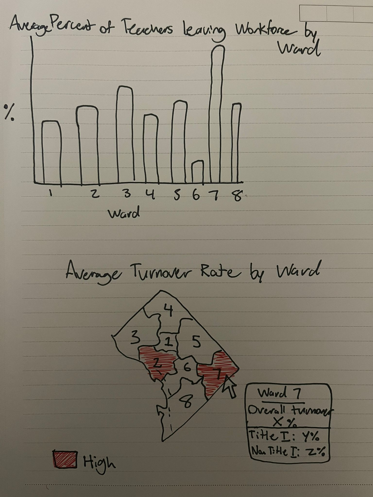

# Teacher Turnover in DC Public Schools

## Outline

  

    When deciding on a topic for the presentation, my first curiosity was with DC Public Schools (DCPS), namely because it was an area that I cared about as a former teacher in DCPS. I also felt like there were insights that could be drawn from the data that the Office of the Superintendent puts out that aren’t being highlighted. Teacher turnover, especially in disadvantaged communities, is a really relevant issue in DCPS and has a substantial impact on student performance and school stability.
  

  

    I looked into the issue in the past but with a much more surface lens. At the time, DC schools were struggling to maintain a good retention rate and created a program called IMPACT as a result. The IMPACT program was a merit-based program for educators who score high in their rubrics to receive an additional bonus. However, the project didn't take into account the turnover rate in disadvantaged schools where it's unlikely that an educator there can score high enough to get the bonus compensation. 
  

  

    In this project, I explore how turnover rates vary across different locations/wards in DC as well as assess the effectiveness of DCPS’s teacher evaluation and retention policies, particularly the IMPACT program (2019 onwards).
  

  

    
    
<em>Sketch 1: Choropleth map of DC by ward</em>

  

  <h3>General Outline</h3>
  <ul>
    <li><strong>Introduction</strong>: Analyze teacher turnover in DC Public Schools (DCPS), particularly focusing on disparities between low-income (Title I) and high-income schools, and the effectiveness of current policies like IMPACT.</li>
    <li><strong>Why It Matters</strong>: Highlight the importance of addressing teacher turnover, especially in schools serving disadvantaged communities, and its impact on school stability and student outcomes.</li>
    <li><strong>What the Turnover Rate Is</strong>:
      <ul>
        <li><strong>Defining Turnover</strong>: Explanation of what teacher turnover means and why it’s a critical issue for DCPS.</li>
        <li><strong>General Turnover Data</strong>: Present overall turnover rates in DCPS, giving an overview of which schools or wards experience the highest turnover.</li>
      </ul>
    </li>
    <li><strong>DCPS’ Current Stats</strong>:
      <ul>
        <li><strong>Current Data on Turnover</strong>: Visualize teacher turnover rates, highlighting patterns and trends by ward, income levels, and school type.</li>
        <li><strong>Demographic Disparities</strong>: Show how teacher turnover differs between socioeconomic areas, emphasizing disparities.</li>
      </ul>
    </li>
    <li><strong>Needs in Title I Schools</strong>: Provide context on Title I schools and why they face higher turnover rates.</li>
    <li><strong>Current Initiatives (IMPACT)</strong>: Overview and limitations of the IMPACT program, focusing on teacher retention.</li>
    <li><strong>Conclusion</strong>: Actionable recommendations for improving teacher retention in Title I schools.</li>
  </ul>

  

    
    
<em>Sketch 2: Bar plot of teacher retention rates by ward</em>

  

## Data & Sketches

  

    For this project, I will be primarily using datasets available from the Office of the State Superintendent of Education (OSSE). These datasets provide crucial information on teacher turnover rates, school performance metrics, and demographic details of schools across Washington, D.C.
  

  

    A few sketches that I thought would make sense with the kind of data being used include a choropleth map of the District by Ward. Since DC has 8 wards, they can indicate geographically noticeable areas that have higher/lower retention rates. I also think bar plots would help with distinguishing the wards for their retention rate.
  

  

    
    
<em>Sketch 3: Tooltip map of turnover by ward</em>

  

## Method and Medium

  

    To complete this project, I will be using Tableau to create interactive data visualizations that showcase teacher turnover rates, demographic disparities, and the impact of DCPS's IMPACT program. My aim is to make the information easy to digest for viewers while allowing them to explore different facets of the data, such as geographic trends and correlations between turnover and school performance.
  

  

    The narrative aspect of the project will be built using Shorthand, an interactive storytelling platform that will help seamlessly integrate the data visualizations with text and other media.
  

<a href="README.md" class="button">Return to Main Page</a>

<footer>
  
&copy; 2024 Hossein Khoshhal. All rights reserved.

</footer>
